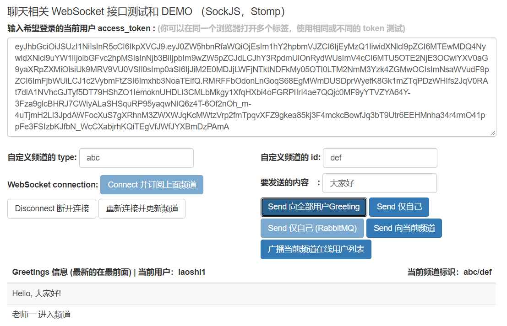

# Spring WebSocket Example
这是一个演示 Spring OAuth2 上整合 WebSocket 的例子，同时有一个整合 RabbitMQ 作为 Message Broker 的分支。

## 特性
* 以 Spring Cloud starter 项目为例。
* Gradle 构建，多层模块结构。同时演示一份微服务模块的代码结构。
* Spring OAuth2, WebSocket, RabbitMQ
* WebSocket 分布式部署
* WebSocket 压测和性能考虑

## 缘由
* 需求：新增在线课堂产品功能，老师创建课堂，配合手机操控多端，进行点名、计时、资源阅读等；学生需要时也能连接课堂，进行作业、考试等互动。
* 考虑多个可选方案，确定先集成 Spring WebSocket 生产上线验证，后期可重新评估，持续改善。详情可见“ WebSocket 压测和性能考虑”中描述的选型考虑。

## 用法

### 相关实现

编译依赖：
```
    // websocket
    compile("org.springframework.boot:spring-boot-starter-websocket")
    // 当前版本 starter-websocket 不包括这个，要显式声明
    compile("org.springframework.security:spring-security-messaging")

    // 辅助调试 websocket 前端（可选）
    compile("org.webjars:webjars-locator-core:0.35")
    compile("org.webjars:sockjs-client:1.0.2")
    compile("org.webjars:stomp-websocket:2.3.3")
    compile("org.webjars:bootstrap:3.3.7")
    compile("org.webjars:jquery:3.1.0")
```

自动配置和扩展：
```
@Configuration
@EnableWebSocketMessageBroker
@Order(Ordered.HIGHEST_PRECEDENCE + 50)
@EnableConfigurationProperties(StompProperties.class)
public class WebSocketConfig extends AbstractSecurityWebSocketMessageBrokerConfigurer {
```

实现业务指令：
```
   /**
     * 通用的给某指定频道发消息.
     *
     * @param message 带有频道信息 type 和 id
     * @param principal 当前用户
     * @throws Exception Exception
     */
    @MessageMapping("/chat/sendMsg")
    public void sendMsg(ChatMessage message, Principal principal) throws Exception {
        if (StringUtils.isBlank(message.getType()) || StringUtils.isBlank(message.getId())) {
            throw new MessagingException("频道type和id不能为空");
        }
        String separator = WsConstant.getNameSeparator(stompProperties.ifExternalBroker());
        String channelId = "/topic/messages" + separator + message.getType() + separator + message.getId();

        Map<String, Object> map = new HashMap<>();
        map.put(MessageHeaders.CONTENT_TYPE, MimeTypeUtils.APPLICATION_JSON);

        ChatMessage result = new ChatMessage("(频道 " + channelId + ") 消息: "
            + HtmlUtils.htmlEscape(message.getContent()); // TODO：目前仅演示，正式时直接转发信息
        result.setId(message.getId());
        result.setType(message.getType());
        messagingTemplate.convertAndSend(channelId, result, map);
    }
```

### 编译和使用

#### (1) build-all-projects.sh 直接运行 ```bash build-all-projects.sh``` 或参考其中的编译命令单独编译。

<pre>
#!/bin/sh

# build_type 有 release 或 test 等

cd base-common; ./gradlew clean build -P build_type=release; cd ..
cd websocket-teaching; ./gradlew clean build -P build_type=release; cd ..
</pre>

#### (2) 运行 websocket-teaching 。请参照 ```websocket-teaching/run-local.sh``` 的启动命令行，可能需要调整 jar 的版本号。

<pre>
java -jar build/libs/basic-websocket-teaching-0.0.1.jar
或调整为：
java -jar build/libs/basic-websocket-teaching-1.0.0.jar
</pre>

#### (3) Websocket 前端辅助调试页面

使用浏览器访问： `http://localhost:8082/api/ws/index.html`



#### (4) 业务指令样例。

```
/**
 * ws 命令 model 基类.
 */
public class BaseCommand {

    /** 从哪个平台发出的: pc | ios | android | web */
    private String fromPlatform;
    /** 角色 */
    private String role;
    /** 时间戳 */
    private Long timestamp;
    /** 类型 */
    private String type;
    /** 动作，不同类型带不同的动作 */
    private String action;

    /**
     * 可由前端自定义的可变指定参数.
     *
     * <p>需要时，前端自定义可变参数，在多端前端交互时使用。参数的意义，由前端确定和使用，后端只是帮助传递</p>
     */
    private Map<String, Object> remarks;
```

```
/**
 * 计时器命令.
 */
public class TimerCommand extends BaseCommand {

    /**
     * The constant TYPE.
     */
    public static final String TYPE = "timer";

    /**
     * 计时类型：顺计时还是倒计时.
     */
    private String subType;
    /**
     * 时长.
     */
    private String time;
```

```
一个指令具体例子（字符串引号可能省略， | 表示值可选其中一个）：
{
 fromPlatform : PC | iOS | Android | web ,
 timestamp：1599146332000 ,
 type: timer ,
 subType: countDown(倒计时) | countUp(顺计时) ,
 action: start(开始计时) | stop(停止计时) | pause(暂停) | reset(重置) | fullScreen(全屏) | （等等） ,
 time: "00:12:23" // 当前计时器的显示时间
}
```

#### (5) WebSocket 分布式部署
具体请查看 “mq” 分支

#### (6) WebSocket 压测和性能考虑
详情请跳转查看配套压测项目及其中的报告分析 [gatling-websocket-stomp](https://github.com/mingt/gatling-websocket-stomp)

### FAQ

（1） 运行日志不停刷新 Connection refused: connect 及 Cannot execute request on any known server 错误？

前者部分与 org.springframework.cloud:spring-cloud-starter-config 配置中心依赖有关。为了演示方便，已略去配置中心，也没有外部运行配置中心，所以默认
尝试连接配置中心 Fetching config from server at: http://localhost:8888 时报错。

前者另一部分和后者与注册中心有关。 注解 EnableEurekaClient 决定了模块作为客户端注册到注册中心，目前已略去也没有外部运行，所以不断尝试重连而报错。

如果的确需要去除，请按参考文档把配置中心、注册中心等先运行起来。

（3） 下一步还能做什么？

(待补充)

## 其他

### Spring Cloud starter
* 注册中心，配置中心，认证中心等已略去。 本项目的业务模块配置改回本地 Spring Boot 配置项。
* 来源于以下项目： [anilallewar/microservices-basics-spring-boot](https://github.com/anilallewar/microservices-basics-spring-boot) 致谢原作者，其最近更新也为 k8s 部署提供了一个方向。
* 为了方便国内访问，正常查看配图，目前在 Gitee 做了一份克隆： [ahming/microservices-basics-spring-boot](https://gitee.com/m1024ing/microservices-basics-spring-boot)
